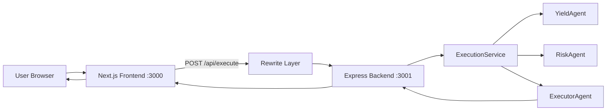
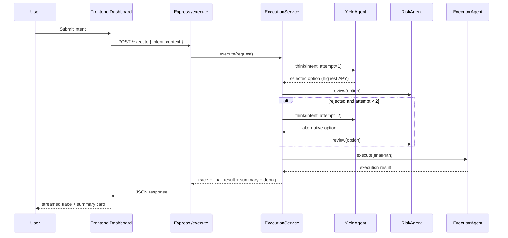

# RelayX Architecture

## 1) System Overview

RelayX is split into a backend execution engine and a frontend visualization UI.

- **Backend service (`backend/`)** receives intent requests and produces deterministic orchestration output.
- **Frontend service (`frontend/`)** provides a landing page plus an execution dashboard, and proxies API calls to backend using Next.js rewrites.

## 2) Runtime Topology

## 3) Backend Orchestration Sequence

## 4) Decision Model in Current Implementation

1. **YieldAgent** has static options:
   - Morpho (4.6, medium risk)
   - Aave (4.2, low risk)
   - Compound (3.8, low risk)
2. Attempt 1 picks highest APY (Morpho).
3. **RiskAgent** rejects:
   - any `high` risk option, or
   - `medium` risk with APY > 4.5.
4. On rejection, orchestrator retries once and picks next best candidate.
5. **ExecutorAgent** returns a successful mock deposit result.

## 5) Trace-Centric Design

Each stage appends an `AgentTrace` entry:

- `agent`: identity string
- `step`: stage label
- `message`: human-readable log line
- `metadata`: structured diagnostic payload
- `timestamp`: synthetic incrementing timeline

This trace powers frontend terminal playback and summary generation.

## 6) Data Contracts

Shared conceptual model (implemented separately in backend and frontend):

- `ExecutionRequest`
- `ExecutionResponse`
- `ExecutionResult`
- `ExecutionSummary`
- `AgentTrace`

Backend is the source of truth for actual response shape.
